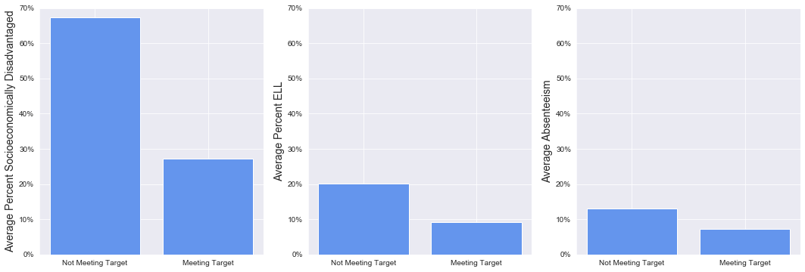
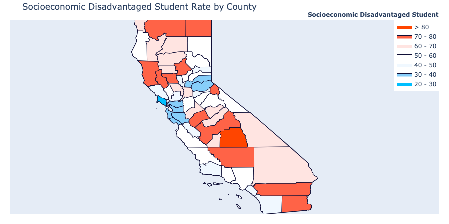
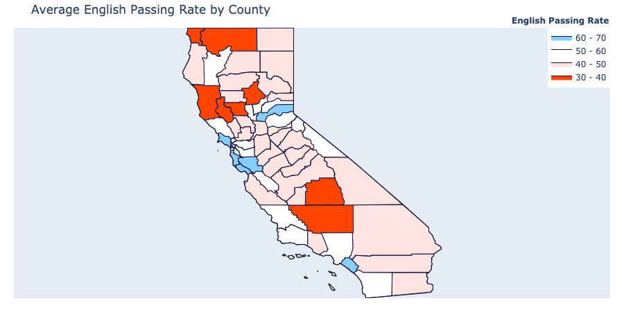

## Predicting California School Performance on ELA Testing


#### ***Amelia Dahm and Lauren Phipps***


## Repository Structure

```
├── data                         <- Sourced externally and generated from code
├── EDA                          <- Notebooks pertaining to EDA and Visualization
├── images                       <- Images and charts used in this project
├── ModelingProcess              <- Notebooks showing interative modeling process
├── Final_Notebook.ipynb         <- Final notebook of project
├── README.md                    <- The high-level overview of this project
├── Presentation.pdf             <- PDF version of project presentation
└── datacleaning.py              <- Code file for data cleaning and preparation
```

## Overview
Using data obtained from the California Department of Education, this project analyzed characteristics of school districts and the district's percentage of students meeting English/Language Arts (ELA) testing standards. As California has a goal of 100% of its students meeting ELA standards within several years, we created a target that districts that have reached 62% of students meeting standard are on track, while others are not. The goal was to create a list of the most important features that impact whether or not a district is on track to reaching 100% proficiency, so that the Department of Education and other policymakers can provide the necessary assistance and support needed to reach their ambitious goal. This project found that the best model was using logistic regression with an adjustment threshold, which found that the most important features is the percentage of students who are socioeconomically disadvantaged. As a result, the California Department of Education should do additional studies into the impact of community funding and support programs, as it is evident that student home life greatly impacts a student's academic performance.
 

## Business Problem
Students' success during and after their K-12 education is closely tied to their literacy skills. Students who are proficient in English/Language Arts (ELA) are more likely to be successful in graduating and attending a post-secondary institution. As part of an initiative that started in 2015, California's goal is to have 100% of students reaching proficiency in ELA by 2023. As we are reaching the final years of this initiative, it is important to be able to predict which schools are on track to meet this target and determine the factors that have the highest impact on the students' proficiency. This project aims to determine these factors in order to address the needs that are not being met with additional funding, intervention programs, or community engagement and support. Through actionable recommendations, we can address the needs of districts that will aid in students reaching proficiency and, hopefully, being more successful throughout their life.


## Data Understanding
The data comes from California Department of Education and contains school district information from 2018-2019. It contains 940 rows, each representing a school district in California. The columns represent different characteristics about that district, from student demographic and enrollment information to geographic information. This data will be used to determine which features of a school have an impact on the percentage of students who meet testing standards in ELA.


## Data Preparation

We began our preparation by dropping columns that were not relevant to the analysis (`OBJECTID`, `CDCode`, etc), as well as columns that had a significant number of null values and were characteristics that only pertained to high schools (`GradPct`, `DropOutPct`, etc). We then created dummy variables out of several of the categorical columns: `SchoolType`, `AssistStatus`, `LocaleDistrict`, and `EnrollTotal`. We created a new feature that expressed `EnrollCharter` as a percent of `EnrollTotal`. Additionally, we scaled down any outliers. 

During this process, we also created the target variable. This was engineered from the `ELAStdPctMet` feature. In order to determine if a school was on target to reach 100% proficiency in ELA, we set the threshold at 61%, which was the value for 75% quantile. If a school is on target, target contains a 1, if not, a 0.

## Results

Based on prior knowledge and experience, we started our analysis by looking at the impact of socioeconomic status, English language learners, and absenteeism on a district being on target. Absenteeism refers to the percentage of students who missed 10 or more school days. 



This chart shows that, as expected, the average percentage of students who are socioeconomically disadvantaged, English language learners, or chronically absent, is higher in districts that are not meeting their testing target. 

Furthermore, the map below shows the relationship between the percentage of students who are socioeconomically disadvantaged and the percentage of students meeting the ELA standards by district.




Again, it is clear to see the impact that socioeconomic status has on ELA testing proficiency.

In creating a model from this data, this project focused on models that are highly interpretable in order to be able to understand the importance of specific characteristics in hopes of obtaining actionable next steps to address the needs of districts. We used precision as the evaluation metric in order to select the best model. This is because this scenario requires minimizing false positives. In this case, we do not want districts to be labeled as on track for success and not receive additional support when they may need it. Using this metric, the best model was the Logistic Regression with a threshold of 0.8. 

From this model, we determined the following features were the most impactful:

`SocioEconDisadvantagePct` (-2.6)

`AsianPct` (+1.0)

`AmericanIndianPct` (-0.73)

`HispanicPct` (+0.65)

`EnglishLanguagePct` (-0.45)

`Rural` (-0.44)

`Assistance` (-0.38; This refers to whether the district is receiving additional support and assistance.)


## Evaluation

As mentioned above, the focus was on improving precision for this model in order to minimize the number of false positives. In other words, we want to minimize the number of districts that are classified as being on track to high proficiency when they are not. The final model had a precision of 94%. While this model may lead to higher rates of false negatives (districts classified as needing support when they do not), there is no downside to giving additional support to districts. The only issue that could arise is resource allocation. 

The true goal of this project, though, was to assess the importance of different features of a district, which this model has done. 

## Conclusion and Next Steps

In conclusion, we would advise the state of California to analyze the schools with the highest percentages of students who are socioeconomically disadvantaged, as this is by far the most significant impactor on student testing performances. Through brief additional analysis into per pupil funding in California, it was found that there is not a significant difference into funding within the school, showing that is important to put funding and investment into these counties specifically. More research should be done into the impact of community funding and support programs, as it is evident that student home life greatly impacts their academic performance. 

Additionally, the state of California should be resources into additional support and intervention programs for English Language learners. 

For next steps, more research should be done into these trends over time, as well as a closer look into the financial breakdowns in per pupil spending to determine if there is more effective ways to allocate the money. 